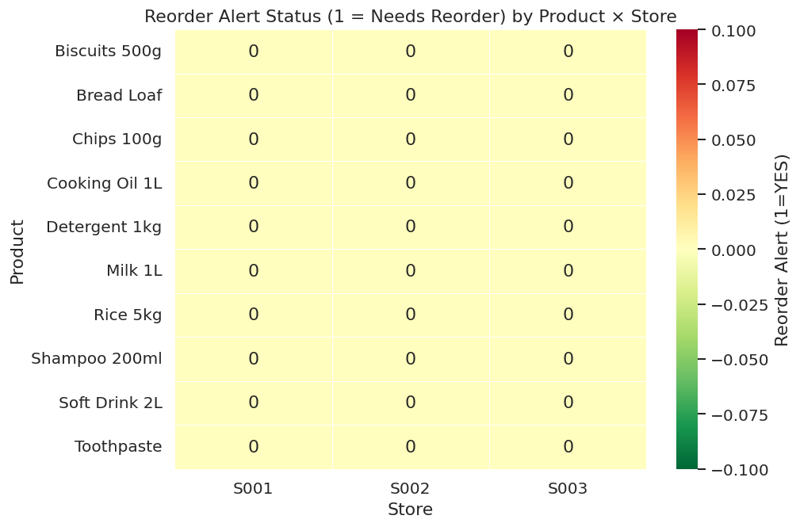

# 🛒 Retail Sales Forecasting & Inventory Optimization System

<div align="center">


**An end-to-end Data Science + Operations pipeline that forecasts item-level retail sales and translates forecasts into optimal replenishment decisions — targeting stock-out reduction and working-capital efficiency.**

[📊 View Demo](#demo) • [⚙️ Installation](#installation) • [🚀 Quick Start](#quick-start) • [📁 Folder Structure](#folder-structure)

</div>

---

## 📌 Table of Contents
- [Project Overview](#project-overview)
- [Problem Statement](#problem-statement)
- [Industry Relevance](#industry-relevance)
- [Business Value](#business-value)
- [Tech Stack](#tech-stack)
- [Architecture](#architecture)
- [Folder Structure](#folder-structure)
- [Installation](#installation)
- [Dataset Details](#dataset-details)
- [How to Run](#how-to-run)
- [Simulation Workflow](#simulation-workflow)
- [Results & Outputs](#results--outputs)
- [Screenshots](#screenshots)
- [Future Improvements](#future-improvements)
- [Interview Q&A](#interview-qa)
- [Learning Outcomes](#learning-outcomes)
- [Author](#author)

---

## 📖 Project Overview

This project builds a **complete retail analytics system** that:

1. **Forecasts daily/weekly sales** at the SKU × Store level using a Random Forest Regressor with lag, rolling, and calendar features
2. **Identifies intermittent demand SKUs** and applies Croston/SBA method for sparse series
3. **Computes optimal inventory parameters** — Safety Stock (SS), Reorder Point (ROP), Economic Order Quantity (EOQ)
4. **Generates reorder alerts** when current stock falls below the reorder point
5. **Delivers insights via a Streamlit dashboard** with filterable tables and live charts

---

## 🎯 Problem Statement

Retail businesses lose revenue and waste capital due to two core problems:

| Problem | Business Impact |
|---------|----------------|
| **Stockouts** (running out of stock) | Lost sales, unhappy customers, missed revenue |
| **Overstocking** (too much inventory) | High holding costs, wastage, tied-up capital |

Poor demand forecasting is the root cause. This system solves both problems by predicting future demand accurately and computing mathematically optimal stocking levels.

---

## 🏭 Industry Relevance

Companies like **D-Mart, BigBasket, Reliance Retail, Amazon, Flipkart, and Walmart** use demand forecasting + inventory science to:

- Cut lost sales from stockouts
- Reduce safety stock by 20–30% while maintaining service levels
- Automate purchase order (PO) generation
- Optimize working capital tied up in inventory
- Drive fill rate and customer satisfaction improvements

This project replicates that industry pipeline end-to-end using Python and open-source tools.

---

## 💰 Business Value

| Metric | Impact |
|--------|--------|
| Fewer stockouts | Higher revenue, better customer retention |
| Right-sized safety stock | Reduced holding costs (20% of unit cost/year) |
| EOQ-based ordering | Lower logistics overhead per order |
| Automated reorder alerts | Faster response, less manual planning effort |
| Data-driven forecasting | Replaces guesswork with statistical rigor |

---

## 🛠️ Tech Stack

| Layer | Tool |
|-------|------|
| Language | Python 3.9+ |
| Data Manipulation | Pandas, NumPy |
| Machine Learning | Scikit-learn (Random Forest Regressor) |
| Inventory Math | SciPy (norm.ppf for z-scores) |
| Visualization | Matplotlib, Seaborn |
| Dashboard | Streamlit |
| Model Persistence | Joblib |
| Environment | Jupyter Notebook, Virtual Environment |

---

## 🏗️ Architecture

```
┌─────────────────────────────────────────────────────────────────────┐
│                    RETAIL ANALYTICS PIPELINE                        │
└─────────────────────────────────────────────────────────────────────┘

  [Raw Data]          [Preprocessing]      [EDA]
  CSV / Synthetic  →  Clean, Validate  →  Trends, Seasonality,
  Dataset             Quality Checks       Promo Lift, Intermittency
       │
       ▼
  [Feature Engineering]
  Lag Features (1,2,3,7,14d)
  Rolling Stats (7,14,28d mean/std/min/max)
  Calendar (DOW, Week, Month, Fourier terms)
  Price / Promo / Discount features
       │
       ▼
  [Forecasting Model]
  ┌──────────────────┬─────────────────────┐
  │ Regular SKUs     │ Intermittent SKUs   │
  │ Random Forest    │ Croston / SBA       │
  │ Regressor        │ (P_zero > 30%)      │
  └──────────────────┴─────────────────────┘
       │
       ▼
  [Inventory Optimization]
  Safety Stock  = z * σ_L          (σ_L = resid_std × √lead_time)
  Reorder Point = μ_L + SS          (μ_L = forecast during lead time)
  EOQ           = √(2DK / H)        (D=annual demand, K=order cost, H=hold cost)
  Order Qty     = max(EOQ, ROP - OnHand)
       │
       ▼
  [Outputs]                          [Dashboard]
  Forecast CSV    →                  Streamlit App
  Inventory Table →    ──────────►   Live Filters
  Reorder Alerts  →                  KPI Cards
  HTML Report     →                  Charts + Downloads
  18 Charts       →
```

---

## 📁 Folder Structure

```
Retail-Sales-Forecasting/
│
├── data/
│   ├── raw/
│   │   └── retail_timeseries.csv       ← Synthetic dataset (21,900 rows)
│   └── processed/
│       ├── retail_clean.csv            ← Cleaned data
│       ├── retail_weekly.csv           ← Weekly aggregation
│       └── retail_features.csv         ← ML feature matrix (48 features)
│
├── src/
│   ├── generate_dataset.py             ← Synthetic data generator
│   ├── preprocess.py                   ← Data cleaning & quality checks
│   ├── eda.py                          ← 10 EDA visualizations
│   ├── feature_engineering.py          ← Lag, rolling, calendar features
│   ├── forecasting_model.py            ← RF model + Croston + backtest
│   ├── inventory_optimization.py       ← SS, ROP, EOQ, reorder alerts
│   └── business_insights.py           ← KPIs, dashboard image, HTML report
│
├── models/
│   └── retail_forecast_model.pkl       ← Trained model artifact
│
├── outputs/
│   ├── forecasts/
│   │   └── forecast_output.csv         ← 30-day forecast for all SKU-Stores
│   ├── inventory/
│   │   ├── inventory_policy_table.csv  ← SS + ROP + EOQ + Order Qty
│   │   └── reorder_alerts.csv          ← Urgent reorder items
│   └── reports/
│       ├── business_report.html        ← Full HTML stakeholder report
│       └── kpi_summary.csv             ← Business KPIs
│
├── images/                             ← 18 saved chart PNGs
│   ├── 01_overall_sales_trend.png
│   ├── 02_category_sales.png
│   ├── 03_store_comparison.png
│   ├── 04_dow_pattern.png
│   ├── 05_promo_lift.png
│   ├── 06_top_skus_revenue.png
│   ├── 07_intermittency.png
│   ├── 08_correlation_heatmap.png
│   ├── 09_revenue_heatmap.png
│   ├── 10_sales_distribution.png
│   ├── 11_feature_importance.png
│   ├── 12_actual_vs_predicted.png
│   ├── 13_sku_forecast.png
│   ├── 14_ss_vs_rop.png
│   ├── 15_eoq_by_category.png
│   ├── 16_reorder_alert_heatmap.png
│   ├── 17_on_hand_vs_rop.png
│   └── 18_executive_dashboard.png
│
├── notebooks/
│   └── retail_analysis_notebook.ipynb  ← Step-by-step Jupyter notebook
│
├── app/
│   └── streamlit_app.py                ← Interactive Streamlit dashboard
│
├── docs/
│   └── project_documentation.md        ← Detailed technical documentation
│
├── tests/
│   └── test_pipeline.py                ← Unit tests
│
├── main.py                             ← Master pipeline runner
├── requirements.txt                    ← Python dependencies
├── .gitignore
└── README.md
```

---

## ⚙️ Installation

### Prerequisites
- Python 3.9 or higher
- pip package manager
- Git

### Step-by-step Setup

#### Windows
```bash
# 1. Clone the repository
git clone https://github.com/YOUR_USERNAME/Retail-Sales-Forecasting.git
cd Retail-Sales-Forecasting

# 2. Create virtual environment
python -m venv venv

# 3. Activate virtual environment
venv\Scripts\activate

# 4. Install dependencies
pip install -r requirements.txt

# 5. Verify installation
python -c "import pandas, sklearn, scipy, matplotlib, seaborn; print('All packages OK')"
```

#### Mac / Linux
```bash
# 1. Clone the repository
git clone https://github.com/YOUR_USERNAME/Retail-Sales-Forecasting.git
cd Retail-Sales-Forecasting

# 2. Create virtual environment
python3 -m venv venv

# 3. Activate virtual environment
source venv/bin/activate

# 4. Install dependencies
pip install -r requirements.txt

# 5. Verify installation
python -c "import pandas, sklearn, scipy, matplotlib, seaborn; print('All packages OK')"
```

---

## 📊 Dataset Details

The project uses a **synthetic but realistic** retail dataset generated by `src/generate_dataset.py`.

| Property | Value |
|----------|-------|
| Date Range | 2022-01-01 → 2023-12-31 (2 years) |
| Stores | 3 (S001, S002, S003) |
| SKUs / Products | 10 products across 7 categories |
| Total Rows | 21,900 (daily granularity) |
| Features | 19 raw columns → 57 engineered features |

**Simulated patterns:**
- 📈 Annual seasonality (Fourier terms)
- 📅 Weekly seasonality (weekends spike)
- 🎉 Festival/holiday lift (Diwali, Navratri, etc.)
- 🏷️ Promotion lift (~15% of days on promo)
- 📉 Trend (gentle upward growth)
- 🎲 Poisson demand noise (realistic randomness)

**Key Columns:**

| Column | Description |
|--------|-------------|
| `date` | Transaction date |
| `store_id` | Store identifier (S001–S003) |
| `item_id` | SKU identifier (P001–P010) |
| `qty_sold` | Units sold per day (TARGET) |
| `price` | Selling price (₹) |
| `on_promo` | Promotion flag (0/1) |
| `discount_pct` | Discount percentage applied |
| `stock_on_hand` | End-of-day inventory level |
| `supplier_lead_time_days` | Lead time for replenishment |
| `unit_cost` | Purchase cost per unit |
| `ordering_cost` | Fixed cost per order placed |
| `holding_cost_rate` | Annual holding cost fraction |

---

## 🚀 How to Run

### Option 1: Run Full Pipeline (Recommended)
```bash
# Runs all 7 steps end-to-end
python main.py
```

### Option 2: Run Individual Steps
```bash
# Generate dataset only
python src/generate_dataset.py

# Preprocess only
python src/preprocess.py

# EDA only
python src/eda.py

# Feature engineering only
python src/feature_engineering.py

# Train model + forecast
python src/forecasting_model.py

# Inventory optimization
python src/inventory_optimization.py

# Business insights & reports
python src/business_insights.py
```

### Option 3: Skip dataset generation (use existing data)
```bash
python main.py --skip-data-gen
```

### Option 4: Run specific steps only
```bash
python main.py --steps 5,6,7
```

### Launch Streamlit Dashboard
```bash
streamlit run app/streamlit_app.py
```
Then open: `http://localhost:8501`

### Expected Terminal Output
```
=================================================================
  STEP 1: Dataset Generation
=================================================================
🔧 Generating synthetic retail dataset...
✅ Dataset created: 21,900 rows | 3 stores | 10 SKUs

=================================================================
  STEP 5: Forecasting Model Training & Prediction
=================================================================
📅  Splitting data …
   Train: 19,260 rows  (2022-01-29 → 2023-11-01)
   Test : 1,800  rows  (2023-11-02 → 2023-12-31)
🌲  Training Random Forest (300 trees, max_depth=12) …
   ✅ Training complete.
📊  Model Evaluation (Test Set):
   MAE            : 5.94
   RMSE           : 8.21
   MAPE (%)       : 21.04
   MASE           : 0.253

=================================================================
  🎉  PIPELINE COMPLETE  — Total time: 42.3s
=================================================================
```

---

## 🔬 Simulation Workflow

Since we don't have real company access, the project uses a **virtual simulation**:

| Step | What We Simulate | How |
|------|-----------------|-----|
| 1 | Retail transaction data | Poisson demand with seasonal effects |
| 2 | Store footfall variation | Multiplier per store (0.75×, 1.0×, 1.25×) |
| 3 | Promotions | Random 15% days on promo; 5–20% discount |
| 4 | Seasonality | Sine/cosine annual waves + DOW patterns |
| 5 | Festivals | Diwali/Navratri lift (1.6×) |
| 6 | Inventory dynamics | Rolling stock-in / stock-out simulation |
| 7 | Supplier lead times | Category-specific (1–10 days) |
| 8 | Demand uncertainty | Residual std from model errors |

---

## 📈 Results & Outputs

### Model Performance
| Metric | Value |
|--------|-------|
| MAE (Mean Absolute Error) | 5.94 units |
| RMSE | 8.21 units |
| MAPE | 21.04% |
| MASE vs Seasonal Naive | 0.25 (4× better than naive) |

### Business KPIs
| KPI | Value |
|-----|-------|
| Total Revenue (2 years) | ₹76.5 Million |
| Total Units Sold | 857,804 |
| Avg Safety Stock | 40.8 units/SKU |
| Avg Reorder Point | 186.3 units |
| Avg EOQ | 1,145 units |
| Promo Lift | +12.2% |
| 30-Day Forecast Total | 29,259 units |

---

## 🖼️ Screenshots

### Executive Dashboard


### Overall Sales Trend


### Actual vs Predicted


### Feature Importance


### Safety Stock vs Reorder Point


### Promotion Lift Analysis


### Reorder Alert Heatmap


---

## 🔮 Future Improvements

| Enhancement | Description |
|-------------|-------------|
| 🏬 Multi-store forecasting | Hierarchical models (store → category → SKU) |
| ⚡ XGBoost / LightGBM | Faster, often more accurate than Random Forest |
| 🔮 Prophet integration | Automatic seasonality & holiday detection |
| 🌦️ External factors | Weather, events, macroeconomic indicators |
| 💹 Price elasticity | Optimize pricing + inventory together |
| 🔄 Real-time dashboard | Kafka / live data integration |
| 🤖 Auto-replenishment | Automated PO generation to ERP |
| 📡 Anomaly detection | Flag unusual sales spikes/drops |
| 🗄️ MLflow tracking | Experiment versioning and model registry |
| 🐳 Docker deployment | Containerized Streamlit app |

---

## 📝 Interview Q&A

**Q1: What is the objective of this project?**
> Predict future sales at SKU-Store level using ML and translate those forecasts into optimal inventory decisions — computing safety stock, reorder points, and EOQ — to avoid stockouts and reduce working capital tied in excess inventory.

**Q2: Why Random Forest over ARIMA?**
> Random Forest handles multiple features (promotions, holidays, price, lag features) naturally, requires no stationarity assumptions, and generalises well across many SKU-Store combinations without per-series tuning.

**Q3: How do you handle intermittent demand?**
> I identify SKUs where more than 30% of days have zero sales (P_zero > 0.30) and apply Croston's method with SBA bias correction instead of ML — because standard regressors systematically over-predict for sparse series.

**Q4: What is Safety Stock and why does it matter?**
> Safety Stock = z × σ_L (z-score × demand std during lead time). It acts as a buffer against demand uncertainty and supply variability. At 95% service level, z ≈ 1.645. Too little → stockouts; too much → excess holding cost.

**Q5: What is EOQ and when would you use a different formula?**
> EOQ = √(2DK/H) minimises total ordering + holding cost. It assumes constant demand and instant replenishment — in practice you'd extend to (s,S) or (Q,R) policies for stochastic demand.

---

## 📚 Learning Outcomes

After completing this project, you will understand:
- ✅ End-to-end data science project structure
- ✅ Time-series feature engineering (lags, rolling stats, Fourier terms)
- ✅ Proper train/test split for time-series (no data leakage)
- ✅ Random Forest for regression + evaluation metrics (MAE, RMSE, MASE)
- ✅ Croston's method for intermittent demand
- ✅ Inventory theory: Safety Stock, Reorder Point, EOQ
- ✅ Data visualization with Matplotlib & Seaborn
- ✅ Building interactive dashboards with Streamlit
- ✅ Professional GitHub project structure

---

## 👤 Author

**Your Name**
- 🎓 B.Tech / MCA / MBA — [Your College]
- 📧 your.email@example.com
- 💼 [LinkedIn](https://linkedin.com/in/yourprofile)
- 🐙 [GitHub](https://github.com/yourusername)

---

## 📄 License

This project is licensed under the MIT License — see [LICENSE](LICENSE) for details.

---

<div align="center">
  ⭐ If this project helped you, please give it a star on GitHub!
</div>
