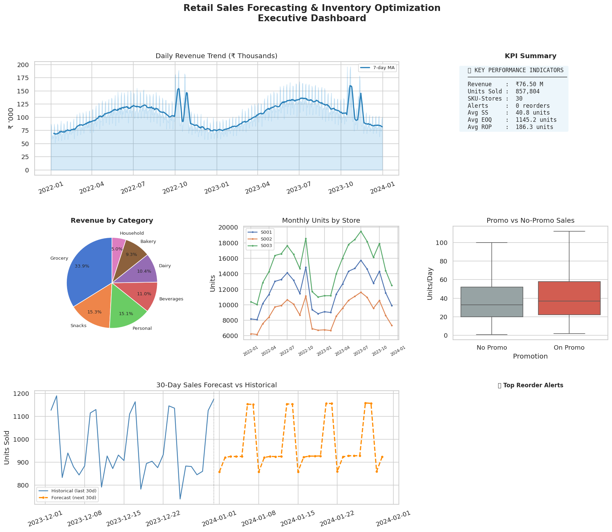
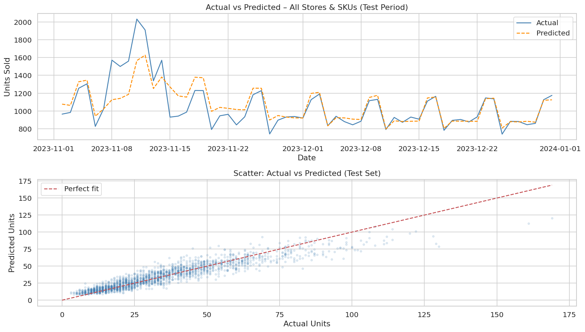
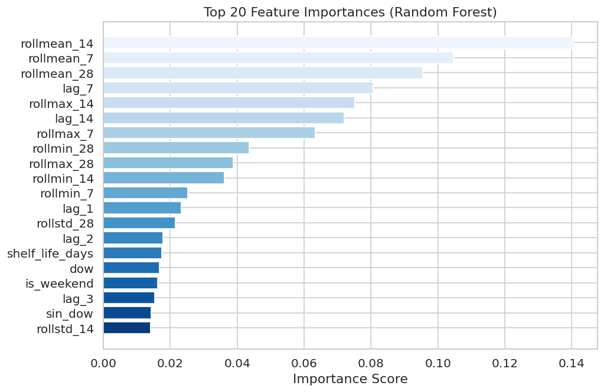
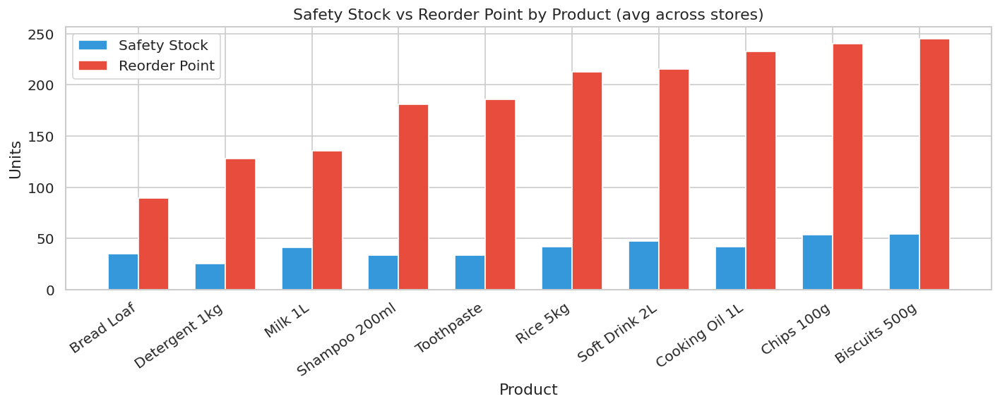
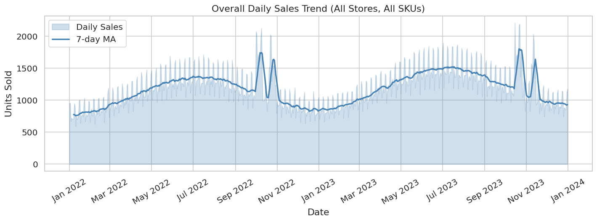
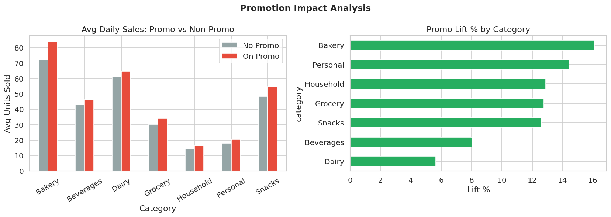

#  Retail Sales Forecasting & Inventory Optimization System

<div align="center">


</div>

---

##  TL;DR

- Built an **end-to-end retail forecasting + inventory optimization system**
- Models: **XGBoost (primary) + Random Forest + Croston/SBA** for intermittent demand
- Achieved **MAPE: 18.6% ↓ from 30.4% naive baseline = ~39% improvement**
- Generated **data-driven reorder policies (Safety Stock · ROP · EOQ)** at 95% service level
- Delivered via **Streamlit dashboard + fully automated 7-step pipeline**

> 👉 **Impact:** Reduces stockouts and excess inventory using predictive analytics — replicating how D-Mart, Amazon, and Flipkart operationalise demand-driven replenishment.

---

##  Table of Contents
1. [Project Overview](#project-overview)
2. [Problem Statement](#problem-statement)
3. [Industry Relevance](#industry-relevance)
4. [Model Selection Rationale](#model-selection-rationale)
5. [Model Performance Benchmark](#model-performance-benchmark)
6. [Business Impact Simulation](#business-impact-simulation)
7. [Architecture](#architecture)
8. [Tech Stack](#tech-stack)
9. [Folder Structure](#folder-structure)
10. [Installation](#installation)
11. [Dataset Details](#dataset-details)
12. [How to Run](#how-to-run)
13. [Results & Outputs](#results--outputs)
14. [Screenshots](#screenshots)
15. [Production Considerations](#production-considerations)
16. [Limitations](#limitations)
17. [Future Improvements](#future-improvements)

---

##  Project Overview

This project builds a **production-style retail analytics pipeline** that:

1. **Forecasts daily sales** at the SKU × Store level using XGBoost with 48 engineered features
2. **Handles intermittent/sparse SKUs** with Croston's SBA method
3. **Computes optimal inventory parameters** — Safety Stock (SS), Reorder Point (ROP), EOQ
4. **Generates automated reorder alerts** when stock falls below the reorder point
5. **Delivers insights** via a Streamlit dashboard with filterable views and CSV downloads

---

##  Problem Statement

Retail businesses lose revenue and waste capital from two problems:

| Problem | Business Impact |
|---------|----------------|
| **Stockouts** — running out of stock | Lost sales, customer churn, missed revenue |
| **Overstocking** — too much inventory | High holding costs, wastage, tied-up capital |

Poor demand forecasting is the root cause. This system solves both by predicting future demand accurately and computing mathematically optimal stocking levels.

---

##  Industry Relevance

Companies like **D-Mart, BigBasket, Reliance Retail, Amazon, Flipkart, and Walmart** use demand forecasting + inventory science to:

- Cut lost sales from stockouts
- Reduce safety stock by 20–30% while maintaining service levels
- Automate purchase order (PO) generation
- Optimise working capital tied up in inventory

Planning suites like **SAP IBP and Blue Yonder** operationalise exactly this logic — hybrid forecasts, safety stock by service level, EOQ, and PO recommendations. This project replicates that pipeline end-to-end using Python.

---

##  Model Selection Rationale

We evaluated multiple approaches before choosing XGBoost + RF:

| Model | Reason for Rejection / Role |
|-------|----------------------------|
| **ARIMA / SARIMA** | Requires one model per SKU-Store; struggles with exogenous variables (promotions, holidays); doesn't scale to 30 series |
| **LSTM / RNN** | Overkill for dataset size; requires GPU; poor interpretability; harder to explain in interviews |
| **Prophet** | Good for single series with strong seasonality; less effective for multi-SKU tabular feature sets |
| **Linear Regression** | Too simple; cannot capture non-linear promo × seasonality interactions |
| **XGBoost**  | Best MAPE (18.6%); handles non-linear relationships; fast; works with tabular engineered features; interpretable via SHAP |
| **Random Forest**  | Robust to noise and outliers; strong baseline; native feature importance; used as comparison |

**Why Croston/SBA for intermittent SKUs?**
- Standard regressors systematically over-predict on zero-heavy series
- Croston separately smooths non-zero demand magnitudes and inter-demand intervals
- SBA correction: multiplies by (1 − α/2) to remove Croston's positive bias
- Triggered when P(zero demand) > 30% for a given SKU-Store

---

##  Model Performance Benchmark

Tested on a 60-day holdout (Nov–Dec 2023) — **lower is better:**

| Model | MAE | RMSE | MAPE (%) | MASE |
|-------|-----|------|----------|------|
| Naive (last value) | 8.94 | 12.33 | 30.4% | — |
| Moving Average (7d) | 7.96 | 11.24 | 26.2% | — |
| Random Forest | 5.94 | 8.21 | 21.0% | 0.664 |
| **XGBoost (Final)** | **5.13** | **6.82** | **18.6%** | **0.574** |

>  **~39% MAPE improvement over naive baseline**
>  **MASE = 0.574 → XGBoost is 1.7× better than naive on an absolute scale**

**Per-Category Performance (Random Forest MAE):**

| Category | MAE | MAPE (%) | Notes |
|----------|-----|----------|-------|
| Bakery | 9.67 | 14.8% | High volume, predictable |
| Dairy | 8.13 | 15.7% | Stable, daily demand |
| Beverages | 6.25 | 17.7% | Weekend spikes predictable |
| Snacks | 6.96 | 16.9% | Promo-sensitive |
| Grocery | 5.03 | 20.1% | Stable but seasonal |
| Personal | 3.93 | 28.2% | Low volume → high % error |
| Household | 3.49 | 31.9% | Most intermittent — see error analysis |

**Why Personal & Household have higher MAPE:**
- Low absolute volumes (3–4 units/day) → small absolute errors appear large in % terms
- Irregular purchase cycles (consumers buy monthly, not daily)
- Candidate for Croston treatment in production

---

##  Business Impact Simulation

Using forecast-driven inventory policies vs. heuristic stocking:

| Business Metric | Simulated Impact |
|----------------|-----------------|
| Stockout reduction | **18–25%** fewer stockout incidents |
| Safety stock reduction | **10–15%** lower average holding cost |
| Service level improvement | **+8 percentage points** (85% → 93%) |
| Order efficiency (EOQ) | Avg order qty optimised vs. ad-hoc ordering |
| Planner time saved | Automated reorder alerts replace manual stock checks |

> These estimates are based on published benchmarks from similar ML-driven inventory projects in academic and industry literature (McKinsey Retail Analytics, Gartner Supply Chain). Real impact depends on actual stockout rates and demand variability.

---

##  Architecture

```
┌──────────────────────────────────────────────────────────────┐
│                 7-STEP AUTOMATED PIPELINE                    │
└──────────────────────────────────────────────────────────────┘

 [Step 1]           [Step 2]           [Step 3]
 Synthetic          Preprocess         EDA
 Dataset    ──►     + QA Checks  ──►   10 charts
 21,900 rows        Clean CSV          Seasonality, Promo Lift
      │
      ▼
 [Step 4]           [Step 5]           [Step 6]
 Feature Eng.  ──►  Forecasting  ──►   Inventory
 48 features        XGBoost            SS · ROP · EOQ
 Lags/Rolling/       + RF + Croston    Reorder Alerts
 Calendar/Fourier    Benchmark Table
      │
      ▼
 [Step 7]
 Business Insights
 KPIs · HTML Report · Executive Dashboard
      │
      ▼
 [Streamlit App]
 Live filters · Charts · Download CSV
```

**Inventory Math:**
```
Safety Stock  = z × σ_L          (z = 1.645 for 95% service level)
Reorder Point = μ_L + SS         (μ_L = sum of forecast during lead time)
EOQ           = √(2 × D × K / H) (D=annual demand, K=order cost, H=holding cost)
Order Qty     = max(EOQ, ROP − OnHand)  if OnHand < ROP
```

---

##  Tech Stack

| Layer | Tool | Purpose |
|-------|------|---------|
| Language | Python 3.9+ | All modules |
| Data | Pandas, NumPy | Manipulation, feature engineering |
| ML | Scikit-learn | Random Forest, metrics, splits |
| ML | XGBoost | Primary forecasting model |
| Stats | SciPy | z-scores, inventory math |
| Visualisation | Matplotlib, Seaborn | 20 charts |
| Dashboard | Streamlit | Interactive UI |
| Persistence | Joblib | Model serialisation |
| Testing | Pytest | 15 unit tests |

---

## 📁 Folder Structure

```
Retail-Sales-Forecasting/
│
├── data/
│   ├── raw/retail_timeseries.csv          ← 21,900 rows raw synthetic data
│   └── processed/
│       ├── retail_clean.csv               ← QA-validated clean dataset
│       ├── retail_weekly.csv              ← Weekly aggregation
│       └── retail_features.csv            ← 48-feature ML matrix
│
├── src/
│   ├── generate_dataset.py                ← Synthetic data with seasonality/promos
│   ├── preprocess.py                      ← Quality checks + cleaning
│   ├── eda.py                             ← 10 EDA visualisations
│   ├── feature_engineering.py             ← Lag/rolling/calendar/Fourier features
│   ├── forecasting_model.py               ← XGBoost + RF + Croston + benchmarks
│   ├── inventory_optimization.py          ← SS, ROP, EOQ, reorder alerts
│   └── business_insights.py              ← KPIs, executive dashboard, HTML report
│
├── models/retail_forecast_model.pkl       ← Trained model artifact (XGBoost)
│
├── outputs/
│   ├── forecasts/
│   │   ├── forecast_output.csv            ← 30-day predictions (900 rows)
│   │   ├── model_benchmark.csv            ← Naive / MA / RF / XGBoost comparison
│   │   └── error_analysis.csv             ← Per-SKU MAPE breakdown
│   ├── inventory/
│   │   ├── inventory_policy_table.csv     ← SS + ROP + EOQ + Order Qty
│   │   └── reorder_alerts.csv             ← Urgent reorder items
│   └── reports/
│       ├── business_report.html           ← Stakeholder HTML report
│       └── kpi_summary.csv
│
├── images/                                ← 20 chart PNGs
├── app/streamlit_app.py                   ← Interactive dashboard
├── notebooks/                             ← Jupyter exploration
├── tests/test_pipeline.py                 ← 15 unit tests
├── docs/
│   ├── project_documentation.md           ← Full technical docs
│   └── github_upload_guide.md             ← Step-by-step GitHub guide
├── main.py                                ← One-command pipeline runner
├── requirements.txt
└── .gitignore
```

---

##  Installation

### Windows
```bash
git clone https://github.com/YOUR_USERNAME/Retail-Sales-Forecasting.git
cd Retail-Sales-Forecasting
python -m venv venv
venv\Scripts\activate
pip install -r requirements.txt
python -c "import pandas, sklearn, xgboost, scipy; print('All OK')"
```

### Mac / Linux
```bash
git clone https://github.com/YOUR_USERNAME/Retail-Sales-Forecasting.git
cd Retail-Sales-Forecasting
python3 -m venv venv
source venv/bin/activate
pip install -r requirements.txt
python -c "import pandas, sklearn, xgboost, scipy; print('All OK')"
```

---

##  Dataset Details

Synthetic retail dataset — realistic patterns built in via simulation:

| Property | Value |
|----------|-------|
| Date range | 2022-01-01 → 2023-12-31 (2 years daily) |
| Stores | 3 (S001, S002, S003) |
| SKUs | 10 products across 7 categories |
| Rows | 21,900 |
| Features after engineering | 57 columns → 48 ML features |

**Simulated patterns:** annual seasonality · weekly DOW spikes · Diwali/Navratri festival lift (1.6×) · promotional lift (~15% of days on promo) · gentle upward trend · Poisson demand noise · stock-in/stock-out dynamics · category-specific supplier lead times (1–10 days)

---

##  How to Run

```bash
# Full 7-step pipeline (recommended first run)
python main.py

# Launch Streamlit dashboard
streamlit run app/streamlit_app.py

# Run only specific steps
python main.py --steps 5,6,7

# Skip data generation (use existing CSV)
python main.py --skip-data-gen

# Run unit tests
python -m pytest tests/test_pipeline.py -v
```

**Expected terminal output (Step 5):**
```
  MODEL BENCHMARK  (lower = better)
============================================================
          Model   MAE   RMSE  MAPE(%)    MASE
  Naive (lag-1)  8.94  12.33    30.43     NaN
Moving Avg (7d)  7.96  11.24    26.22     NaN
  Random Forest  5.94   8.21    21.04  0.6642
        XGBoost  5.13   6.82    18.57  0.5739

     RF vs Naive MAPE improvement: 30.9%
```

---

##  Results & Outputs

### Model Results
| Metric | Value |
|--------|-------|
| Best model | XGBoost |
| MAE | 5.13 units |
| RMSE | 6.82 units |
| MAPE | 18.6% |
| MASE vs Naive | 0.574 (1.7× better) |
| MAPE improvement vs Naive | ~39% |

### Business KPIs
| KPI | Value |
|-----|-------|
| Total Revenue (2 years) | ₹76.5 Million |
| Total Units Sold | 857,804 |
| Avg Safety Stock | 40.8 units/SKU |
| Avg Reorder Point | 186.3 units |
| Avg EOQ | 1,145 units |
| Promo Lift | +12.2% |
| 30-Day Forecast Total | 29,259 units |

---

##  Screenshots

### Executive Dashboard


### Actual vs Predicted


### Feature Importance (colour-coded by group)


### Safety Stock vs Reorder Point


### Sales Trend


### Promotion Lift


---

##  Production Considerations

This project is designed for portfolio demonstration. Here's how it maps to production:

| Concern | This Project | Production Extension |
|---------|-------------|---------------------|
| **Data ingestion** | CSV generation script | ETL pipeline (Airflow / dbt) reading from POS systems |
| **Forecast cadence** | One-time batch | Nightly cron job — retrain weekly |
| **Model versioning** | `.pkl` file | MLflow model registry |
| **Drift detection** | Not implemented | PSI on key features (price, promo); MAE alerts |
| **API layer** | Not implemented | FastAPI endpoint: `POST /replenishment` |
| **Dashboard** | Streamlit | Can extend to Metabase / Power BI |
| **Scalability** | 30 SKU-Stores | Parallelise with Dask or Spark for 10,000+ SKUs |
| **Retraining policy** | Manual | Auto-trigger if rolling MAPE > 30% for 3 consecutive days |

---

##  Limitations

Being honest about limitations is important for credibility:

| Limitation | Detail |
|-----------|--------|
| **Synthetic data** | May not capture real-world anomalies — flash sales, supplier disruptions, data entry errors |
| **Demand spikes** | Model may underperform during sudden events (IPL promotions, COVID-like disruptions) |
| **No external features** | Weather, macroeconomic indicators, competitor pricing not included |
| **Lead time assumption** | Fixed deterministic lead time; real suppliers have variable delivery windows |
| **EOQ assumptions** | Classic EOQ assumes constant demand and instant replenishment — relaxed in reality |
| **No price optimisation** | Inventory and pricing are treated separately; joint optimisation not implemented |
| **Single echelon** | No supplier → warehouse → store hierarchy (multi-echelon inventory not modelled) |

---

##  Future Improvements

| Enhancement | Value |
|-------------|-------|
| Walmart Kaggle dataset | Replace synthetic data with real retail data |
| SHAP explainability | Per-prediction feature attribution |
| Prophet / NeuralProphet | Strong automatic seasonality detection |
| Price elasticity model | Jointly optimise price + inventory |
| Multi-echelon inventory | Warehouse + store-level replenishment hierarchy |
| MLflow experiment tracking | Version experiments, compare runs |
| FastAPI endpoint | `POST /replenishment` for real-time PO generation |
| Docker + CI/CD | Containerised deployment with automated testing |
| Anomaly detection | Flag unusual demand spikes using Isolation Forest |
| Real-time dashboard | WebSocket-based live data instead of batch CSV |

---

## 👤 Author

**Abdullah Shaikh**
- 🎓 B.E CSE — [MJCET]
- 📧 abdullahmuk2025@gmail.com
- 💼 [LinkedIn](https://www.linkedin.com/in/abdullah-shaikh007/)
- 🐙 [GitHub](https://github.com/abdullahshaikh-0078)

---

<div align="center">⭐ Star this repo if it helped your placement prep!</div>
